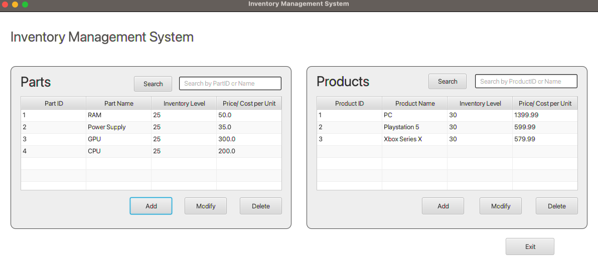

/** @author Bao Quoc Tran - C482 Ver 2.0  
* A JavaFX program that simulates an inventory management system with the ability to add,
* modify and delete both parts and products,  
* while also incorporating parts into products.
* The future enhance will be located in Utility where it stores
* methods, and variables for future expansion of the project
* Required JAVA FX SDK */

  

